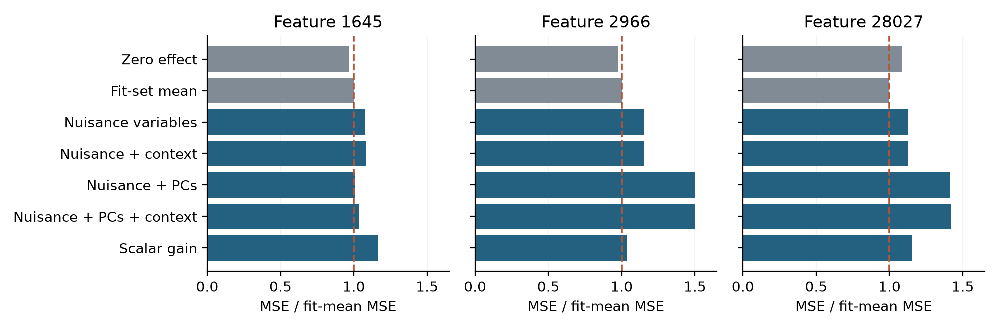
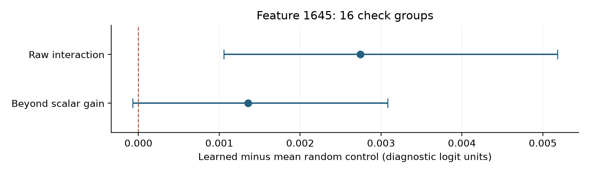

# Can activation context predict SAE intervention effects?

Serafim Tkachenko · September 2026

**Result:** the tested context predictors did not beat a training-mean baseline on pooled check data for any of the three features. Weak and strong feature activations did occur in different contexts, but that observation did not translate into useful prediction in this pilot.

## The question

A sparse autoencoder (SAE) represents a model's hidden state using a small number of active dictionary entries. Each entry has a fixed decoder direction. Adding that direction to a hidden state changes the model's output, but the effect can depend on the surrounding state.

This study asked whether that context dependence could be measured before an intervention and used to predict its effect on a new prompt. The proposed predictor used a context direction estimated from ordinary, unedited activations. The experiment also tested whether moving along that direction changed the decoder intervention's effect more than generic directions did.

The distinction matters: finding different activation contexts is an observational result. A useful predictor must improve held-out predictions, and a proposed context mechanism must survive comparisons with simpler explanations. The pilot found the first kind of result and did not establish the second.

## Data and design

The observational study used pretrained Gemma 3 4B and Gemma Scope 2 residual-stream SAEs at layers 17 and 22. It collected 12,000 documents: 6,000 from FineWeb-Edu and 6,000 from English Wikipedia. Each layer had 4,047,982 eligible token positions. These are two layers of the same model on the same corpus.

Discovery and evaluation documents were separated by detected duplicate group. On discovery data, a screen of 2,048 supported entries per layer selected up to 24 whose positive activation distributions were well described by two separated Gaussian components. The fitted boundaries were then frozen. This selects unusual activation distributions; it does not establish two meanings or two genuinely distinct modes.

Two separate tests compared weak and strong activations on evaluation documents: which other SAE entries activated alongside the focal entry, and how the mean hidden state shifted perpendicular to its decoder direction. Tests conditioned on token identity, coarse position and activation-support bins. Each required evidence in both sources, with separate Benjamini-Yekutieli corrections across the 24 candidates. One occurrence per duplicate group was used for each feature/source comparison.

The intervention pilot used three layer-17 entries: 1645, 28027 and background comparison 2966. Another planned comparison, 7087, lacked sufficient support and was not run. There were 32 prompts per feature, split into 16 fit and 16 check cases. The 96 feature-prompt cases came from 95 duplicate groups, with no group crossing the fit/check split. Repeated doses and directions produced 5,376 factorial comparisons, not 5,376 independent observations.

## Finding 1: activation context differed, with limited specificity

| Layer | Selected entries | Partner-composition rejections | Decoder-orthogonal rejections |
| --- | ---: | ---: | ---: |
| 17 | 24 | 14 | 3 |
| 22 | 24 | 18 | 6 |

These counts describe the discovery-selected entries under the stated tests. They do not estimate prevalence across the dictionary. The smaller orthogonal counts also matter: a change in coactivating partners did not usually produce a significant native-state displacement beyond the decoder axis.

The comparison features weakened the case for a phenomenon specific to mixture-selected entries. Strict low-BIC matching found no suitable pairs. Only four weaker control pairs per layer had enough evaluation support, and all eight supported controls also rejected their pooled contextual nulls. At layer 17 the candidates had larger raw partner differences; this pattern did not consistently carry over to layer 22.

There was no completed semantic annotation. For example, inspected contexts for entry 1645 included digits within year-like strings in both activation ranges. Such examples suggest formatting and token-position explanations worth testing, but they do not establish a semantic label.

## Finding 2: fitted predictors lost to the fit-set mean

For each prompt, the target was a two-coordinate change in output logits caused by a decoder edit. The coordinates compared digit tokens with punctuation, and common word-start tokens with suffixes. They are formatting diagnostics, not validated measures of reasoning or task success. MSE averages the squared errors of these two coordinates in their original units.

The fitted models used ridge regression with fit-only preprocessing and fixed regularization. The nuisance model used activation, residual norm and lexical/position/support variables. The context model added a learned context score; the PC variants also used eight principal-component scores. The context direction itself was estimated without intervention outcomes.

A later audit added two missing baselines to the same saved prediction task: always predict zero, and predict the fit-set mean effect separately for each feature and decoder dose. Neither baseline uses check outcomes. The table includes all fitted model families and averages both doses on pooled check data.

| Predictor | Feature 1645 | Feature 2966 | Feature 28027 |
| --- | ---: | ---: | ---: |
| Zero effect | 0.00123435 | 0.0000102794 | 0.000244555 |
| Fit-set mean | 0.00127447 | 0.0000105387 | 0.000225452 |
| Nuisance variables | 0.00137161 | 0.0000121156 | 0.000254669 |
| Nuisance + context | 0.00137644 | 0.0000121219 | 0.000254411 |
| Nuisance + PCs | 0.00128379 | 0.0000158104 | 0.000317980 |
| Nuisance + PCs + context | 0.00132388 | 0.0000158345 | 0.000319957 |
| Scalar gain | 0.00148587 | 0.0000108994 | 0.000259432 |

Lower is better. The fit-set mean had lower point-estimate MSE than every fitted model for all three entries. Zero also beat every fitted model for 1645 and 2966. Adding context did not fix the problem. This small retrospective comparison does not establish population-level superiority.

**Figure 1.** All fitted models are above the fit-mean reference. Normalizing within each feature avoids comparing raw error scales across differently sized decoder edits. Exact values and source-transfer comparisons are in the linked CSVs.

## Raw interaction increased; selectivity remained unresolved

The context edit preserved the focal encoder score, decoder coordinate and residual norm within numerical tolerance. For a hidden state h, decoder edit d and context-edited state h', the four-cell interaction was:

`I = [Y(h' + d) - Y(h')] - [Y(h + d) - Y(h)]`

This measures how the context edit changes the decoder effect. A nonzero interaction can arise from ordinary nonlinear computation. Even normalization can produce one despite preservation of the input norm.

For entry 1645, the learned direction exceeded the mean random-direction control in raw interaction norm by 0.002742, with a descriptive group-bootstrap interval of [0.001054, 0.005180]. After removing the best scalar rescaling of the original effect, the difference was 0.001354, with interval [-0.0000716, 0.003081]. There were only 16 check groups. Superiority over the leading-PC control was also not established.

**Figure 2.** These intervals condition on the selected directions and fixed analysis. Removing scalar gain changes the question from effect magnitude to a change in direction within the two diagnostic coordinates. Neither coordinate is a validated behavior.

The signed-response analyses in the longer report describe local response structure in these same outputs. They provide no additional independent prompts and do not rescue the failed prediction comparison.

## What this result changes

The observed contextual differences are insufficient justification for the proposed predictor. Before collecting more interventions, the prediction task needs a meaningful outcome and a calibration design that can beat constants and simple activation/lexical predictors.

There are several unresolved explanations for the failure. Each feature has only 16 pooled fit cases; the PC-plus-context designs have 24-33 columns before the intercept, and regularization was not tuned. Interventions may leave the natural activation distribution. The two readout coordinates have arbitrary relative scale. Encoder conditioning and covariance also provide a generic explanation for some observational shifts.

A follow-up would first validate one signed task outcome, select a small predictor using separate training/validation groups, and evaluate it once on new prompt families against constants, activation/lexical variables and PCs. Such a follow-up has not been run.

## Evidence and reproduction

The [prediction table](../../evidence/sae_prediction/prediction_summary.csv), [per-case errors](../../evidence/sae_prediction/prediction_errors.csv), [paired controls](../../evidence/sae_prediction/paired_controls.csv) and [verification record](../../evidence/sae_prediction/verification.json) accompany this report. The recheck verified 96 archived prompt files, reconstructed all 5,376 interactions, and reproduced 768 historical prediction errors to a maximum absolute discrepancy below 1e-12. It reused saved inference; it did not rerun the model.

Run `scripts/check_prediction_baselines.py` with the released intervention ZIP to reconstruct those tables. Run `scripts/build_sae_context_report.py` to rebuild the figures and PDF from committed tables and this Markdown. See the [reproduction guide](../../docs/reproduction.md) for commands and downloads.

The [longer September report](../research_report/report.md) preserves full methods, the geometry survey and exploratory signed analyses. Its earlier prediction discussion predates the constant-baseline comparison above. The separate [coding-repair pilot](../../experiments/coding_forensics/RESULTS.md) is not evidence for the SAE hypothesis.

## References

- [Gemma Scope 2](https://deepmind.google/blog/gemma-scope-2-helping-the-ai-safety-community-deepen-understanding-of-complex-language-model-behavior/): pretrained sparse autoencoders used for the study; exact identifiers are in the archived protocol.
- [The original methods and references](../research_report/report.md): model, datasets, statistical procedures and related work.
- [Public artifact inventory](../../artifacts/README.md): downloads, checksums and historical runtime sources.
